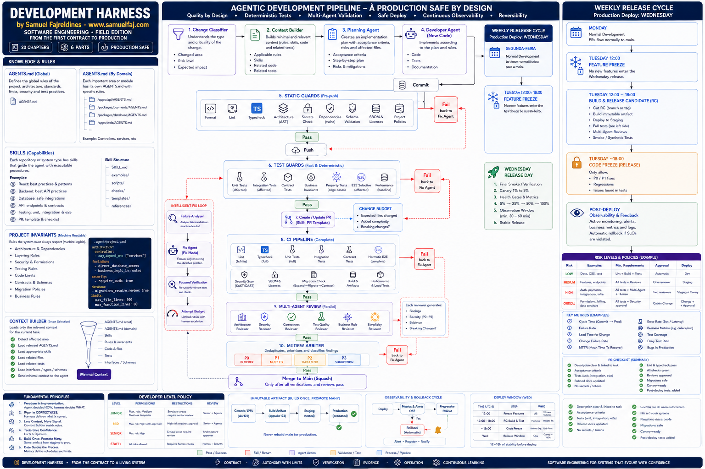

# sam-harness

[English](../README.md) | [Español](README.es.md)

O Sam Harness transforma a arquitetura, os comandos, o caminho até produção e os riscos reais de um repositório em instruções duráveis e em um ciclo de desenvolvimento executável para agentes de programação. Ele não joga um prompt enorme em toda conversa. Uma skill portátil orienta a adoção e a operação, um CLI em Go cria planos e recibos determinísticos, e os arquivos instalados mantêm as regras ativas depois que o chat termina.

O método vem do livro [Development Harness](https://www.samuelfaj.com/books/development-harness-course/development-harness-course.html), de Samuel Fajreldines.

[](https://www.samuelfaj.com/books/development-harness-course/development-harness-course.html)

Leia o livro: [🇧🇷 Português](https://www.samuelfaj.com/books/development-harness-course/development-harness-course.html) · [🇺🇸 English](https://www.samuelfaj.com/books/development-harness-course/development-harness-course.en-US.html) · [🇪🇸 Español](https://www.samuelfaj.com/books/development-harness-course/development-harness-course.es.html)

## Instale a skill

```bash
npx skills add samuelfaj/sam-harness --skill sam-harness -g
```

Entre em um repositório e diga ao agente:

```text
Aplique o sam-harness aqui.
```

Quando o agente aceitar invocação explícita, prefira:

```text
Use $sam-harness e aplique o harness neste repositório.
```

```text
/sam-harness apply
```

A skill pede autorização antes de baixar o CLI. Os scripts de bootstrap exigem Cosign e conferem o certificado da release e o checksum antes de instalar o binário no cache do usuário.

O pedido equivalente funciona nos três idiomas aceitos:

```text
Aplique o sam-harness aqui.
Apply sam-harness here.
Aplica sam-harness aquí.
```

A URL do repositório basta para o Codex ou o Claude Code descobrirem a skill portátil, o CLI verificado e o contrato de adoção. Prefira a skill `$sam-harness` já instalada; senão siga o mesmo caminho guiado do CLI. Não baixe o CLI até o operador pedir; depois verifique checksum, assinatura e versão.

```text
Me ajude a implementar aqui o https://github.com/samuelfaj/sam-harness
Pergunte o que o repositório não prova, adapte ao projeto, implemente os controles que faltam em etapas aprovadas e termine com evidência.
```

```text
Help me completely implement https://github.com/samuelfaj/sam-harness in this repository.
Ask me what cannot be inferred, adapt it to this project, implement missing controls in approved stages, and finish with evidence.
```

```text
Ayúdame a implementar aquí https://github.com/samuelfaj/sam-harness
Pregunta lo que el repositorio no demuestra, adáptalo al proyecto, implementa los controles que falten en etapas aprobadas y termina con evidencia.
```

Esses pedidos executam `sam-harness onboard`, `sam-harness adopt --auto` ou `sam-harness adopt --guided`. O agente pergunta só o que a árvore não prova, grava um arquivo de respostas reutilizável sem valores de credencial, mostra o ID do plano, os arquivos, a autoridade e os gates antes de qualquer escrita, e aplica somente com `--accept` desse ID.

## Como funciona

1. `scan` lê manifests, comandos, workspaces, CI, estado do Git e indícios de interface, persistência e deploy. Ele registra comandos literais de jobs GitLab e GitHub com seus diretórios efetivos; uma correspondência exata já pertencente à CI do cliente aparece no plano e é omitida dos gates gerados pelo Harness. Comandos dinâmicos ou não equivalentes continuam obrigatórios. Ele não edita o repositório.
2. O agente pergunta apenas sobre fatos de negócio que o código não prova, como criticidade, sensibilidade dos dados, uso em produção, autoridade, design, rollback, responsáveis, comandos ambíguos e um provedor de CI não detectado.
3. `plan` recomenda `baseline`, `production` ou `regulated` e lista cada operação sob um identificador criptográfico que expira após 30 minutos.
4. O usuário revisa e aprova esse identificador.
5. `apply` recusa um plano se o repositório mudou e grava somente as operações aprovadas.
6. `doctor` verifica a estrutura instalada. `check` executa os gates locais configurados e grava um recibo de evidência.
7. `pipeline` executa uma fase aprovada — checks estáticos, testes, review pré-merge com seis papéis, artefato, staging, produção, observação, rollback ou migração — e grava um recibo específico da fase.
8. Se `static`, `test`, `review` ou `artifact` falhar e a correção tiver sido habilitada explicitamente, `repair` valida o recibo atual, executa o comando configurado em um sandbox Git isolado, aplica os limites cumulativos de tentativas/arquivos/linhas, repete `static` e `test` e emite um patch apenas da correção com seu SHA-256. Recibos de review com falha carregam um manifesto de reparo com hash contendo a mudança exata e o critério de aceitação observável de cada reviewer, para corrigir todo o trabalho conhecido junto antes do re-review independente.

O Sam Harness preserva o conteúdo existente de `AGENTS.md`, `CLAUDE.md`, `GEMINI.md`, instruções do Copilot, `.gitignore` e GitLab CI por meio de blocos delimitados. Ele acrescenta orientações de workflow, revisores, orçamento de mudança, observação e aposentadoria sem substituir conteúdo do usuário.

## Comandos

```text
sam-harness scan [path] [--format human|json]
sam-harness plan [path] --profile auto|baseline|production|regulated [--answers arquivo]
sam-harness apply --plan <arquivo> --accept <plan-id>
sam-harness onboard [path] [--answers arquivo] [--answers-output arquivo] [--locale en-US|pt-BR|es] [--accept plan-id] [--output arquivo] [--format human|json] [--interactive true|false]
sam-harness adopt --auto [path] [--answers arquivo] [--answers-output arquivo] [--locale en-US|pt-BR|es] [--accept plan-id] [--output arquivo] [--format human|json]
sam-harness adopt --guided [path] [--answers arquivo] [--answers-output arquivo] [--locale en-US|pt-BR|es] [--accept plan-id] [--implement controle] [--waiver-control id --waiver-risk texto --waiver-reason texto] [--output arquivo] [--format human|json]
sam-harness bootstrap github [path] [--accept plan-id] [--format human|json]
sam-harness bootstrap gitlab [path] [--accept plan-id] [--format human|json]
sam-harness stage classifier|context|planning|implementation|review|repair --input arquivo [--format human|json]
sam-harness freeze check [path] [--policy arquivo] [--now rfc3339] [--exception arquivo] [--head sha] [--base sha] [--branch nome] [--kind feature] [--scheduled-release true|false]
sam-harness check [path] [--format human|json] [--receipt true|false]
sam-harness doctor [path]
sam-harness upgrade [path] --to <versão> [--answers <arquivo>] [--output <arquivo>]
sam-harness pipeline [path] [--config <arquivo-absoluto-ou-contido>] [--review-base <diretório-absoluto> --review-base-sha <hex> --review-head-sha <hex>] --phase <static|test|review|artifact|staging|production|observe|rollback|migration|all> [--receipt true|false]
sam-harness repair [path] [--config <arquivo-absoluto-ou-contido>] --receipt <arquivo> [--receipt-output true|false]
```

Por padrão, os planos ficam no diretório temporário do sistema operacional. `--output` só aceita um arquivo novo fora do repositório. Arquivos existentes e caminhos internos são recusados. `scan` e `plan` não alteram arquivos versionados.

## Exemplo completo do ciclo

Primeiro, inspecione o repositório e prepare o plano. O arquivo de respostas fica fora do repositório e registra os comandos e responsáveis reais que a inspeção do código não consegue provar:

Para um plano `production` ou `regulated`, use o [formato da configuração do workflow](../skills/sam-harness/references/workflow-configuration.md) e substitua todos os valores de exemplo por comandos aprovados do repositório ou provedor.

```bash
sam-harness scan /caminho/do/repositorio --format json
sam-harness plan /caminho/do/repositorio --profile auto --answers /tmp/sam-harness-respostas.json
```

Revise a justificativa do perfil, as decisões pendentes, todas as operações de arquivo, a expiração e o ID do plano. Somente depois de aprovar esse ID exato:

```bash
sam-harness apply --plan /tmp/sam-harness-plano.json --accept <id-do-plano>
sam-harness doctor /caminho/do/repositorio
sam-harness check /caminho/do/repositorio --receipt true
```

Em um ciclo de produção, execute cada fronteira separadamente para manter o estado visível. Um review pré-merge também precisa de um checkout confiável e separado da base proposta, além dos SHAs exatos da base e do head. Antes de staging, migração, produção ou rollback, confirme a autoridade para o efeito externo:

```bash
sam-harness pipeline /caminho/do/repositorio --phase static --receipt true
sam-harness pipeline /caminho/do/repositorio --phase test --receipt true
sam-harness pipeline /caminho/do/repositorio --review-base /caminho/absoluto/da/base-confiavel --review-base-sha <sha-da-base> --review-head-sha <sha-do-head> --phase review --receipt true
sam-harness pipeline /caminho/do/repositorio --phase artifact --receipt true
sam-harness pipeline /caminho/do/repositorio --phase staging --receipt true
sam-harness pipeline /caminho/do/repositorio --phase migration --receipt true
sam-harness pipeline /caminho/do/repositorio --phase production --receipt true
sam-harness pipeline /caminho/do/repositorio --phase observe --receipt true
```

`--review-base`, `--review-base-sha` e `--review-head-sha` só são válidos com `review` ou `all`; os flags de SHA precisam aparecer juntos e exigem o diretório-base. Review com secrets exige os três. Os SHAs hexadecimais de 40 ou 64 caracteres precisam corresponder ao `HEAD` dos checkouts de base e alvo antes e depois do review. O recibo registra `review_base_root`, `review_base_sha`, `review_base_fingerprint`, `review_head_sha`, `review_head_fingerprint`, o artefato `review_patch` canônico e `review_patch_sha256`; os prompts dos reviewers carregam somente `review_patch_path` e `review_patch_sha256`, para que leiam o diff não confiável no sandbox isolado sem embutir seus bytes. Qualquer mudança de identidade ou conteúdo bloqueia. Um review local somente do head, sem `--review-base`, ainda pode ser útil, mas não satisfaz o gate pré-merge obrigatório sobre o delta.

A convergência do review segue uma política fixa: a passagem inicial revisa o diff completo do MR entre base e head e congela seu manifesto; as passagens posteriores revalidam esses findings congelados pelos IDs do mesmo reviewer; somente um novo P0/P1 comprovado no delta de correção entre o head anterior e o atual pode entrar no ledger bloqueante. Novos P2/P3 e problemas preexistentes não relacionados não iniciam outro loop de correção. Findings iniciais e novas regressões P0/P1 precisam apontar uma linha adicionada ou modificada no patch aplicável, ou a linha `0` somente para evidência de arquivo com apenas remoção, arquivo excluído ou renomeação pura. Falta de prova bloqueia. Cada recibo JSON possui um HTML independente e escapado ao lado.

`--phase all` é conveniente em uma automação já aprovada, mas não dispensa a proteção do ambiente de produção nem a aprovação manual; forneça o diretório-base e o par de SHAs quando `all` precisar satisfazer review pré-merge com secrets do provedor. Rollback nunca faz parte de `all` nem começa automaticamente depois de uma falha; use sua entrada manual independente apenas quando houver runbook e autoridade correspondentes:

```bash
sam-harness pipeline /caminho/do/repositorio --phase rollback --receipt true
```

Se um recibo indicar falha e a correção limitada estiver habilitada:

```bash
sam-harness repair /caminho/do/repositorio --receipt .sam-harness/evidence/<recibo-com-falha>.json --receipt-output true
```

O reparo aceita somente um recibo produzido pela versão atual, com falha ou bloqueio, de `static`, `test`, `review` ou `artifact` deste repositório. Um recibo de review com falha precisa conter um manifesto de reparo íntegro, sem conflitos e vinculado às mesmas identidades, fingerprints, digest do patch e findings. O prompt exige verificar independentemente e aplicar todas as ações do manifesto em um delta coerente, sem parar no primeiro item nem adiar trabalho já conhecido. O reparo automático de review é limitado a uma passagem: a branch resultante recebe re-review independente, mas não pode gerar outra branch automática de reparo. Um recibo transportado entre workspaces limpos da CI só é religado depois que a identidade do repositório, o digest da configuração e os fingerprints inicial e final coincidem com o alvo. O reparo envia um prompt estruturado que contém o recibo não confiável — não o recibo bruto como instrução — para um sandbox Git temporário e autônomo, sem remotes Git, hooks do repositório ou credenciais Git herdadas. Seu ambiente de processo limpo expõe apenas os secrets configurados com scope `repair`. Antes dos checks ou de qualquer aplicação, o Sam Harness bloqueia se um secret exposto à correção aparecer em novos bytes de arquivo regular, em um alvo de symlink alterado ou em uma linha adicionada ao patch; uma ocorrência inalterada que já estava no baseline não é tratada como novo vazamento. Escape por symlink, mudança nos controles do Git, estado obsoleto do alvo e excesso de orçamento também bloqueiam o fluxo. Um delta bem-sucedido precisa passar por novos `static` e `test` antes de ser aplicado ao alvo ainda inalterado. O re-review independente continua obrigatório. O recibo registra o patch somente da correção e `repair_patch_sha256`.

Se a publicação de change request estiver habilitada e autorizada separadamente, a CI envia esse par patch/recibo como dados não confiáveis a um publisher separado por credenciais. Ele exige exatamente um patch e um recibo, confere nome e SHA-256, desabilita hooks, aplica apenas o patch na branch de reparo configurada e abre PR ou MR. Nunca envia diretamente para uma branch protegida.

Para atualizar uma instalação legada de produção, informe as decisões obrigatórias do workflow da versão atual em um arquivo de respostas:

```bash
sam-harness upgrade /caminho/do/repositorio --to 0.8.6 --answers /tmp/sam-harness-respostas-v0.8.json
```

`upgrade` combina as respostas explícitas com a configuração instalada e produz um plano com expiração; ele não aplica o plano. Revise decisões pendentes e todas as operações, depois aprove e aplique o novo ID exato. Use o [formato da configuração do workflow](../skills/sam-harness/references/workflow-configuration.md) para a cobertura de guards `static`/`test`, as decisões sobre nomes de secrets, ambiente protegido dos agentes e control plane do provedor, as atestações de filesystem e de comando confiável, e os comandos de ciclo que uma configuração legada de produção v0.1 não contém.

## Fronteiras de confiança

- `scan` e `plan` não editam arquivos-fonte versionados. `pipeline` orquestra comandos configurados e recibos em vez de editar o código diretamente, mas esses comandos podem alterar o repositório ou sistemas externos. `apply` grava somente um plano não expirado, aprovado explicitamente e cujo fingerprint ainda corresponde ao repositório.
- Um comando configurado é política executável, não permissão permanente. O usuário precisa autorizar a execução remota, deploy, rollback, migração, mudança de credencial ou ação irreversível atual.
- O Sam Harness calcula o fingerprint antes e depois de `static` e `test` e bloqueia a fase se esses comandos alterarem o repositório. O bloqueio não restaura a árvore. Isso detecta mutação do repositório; não isola efeitos externos. Cada comando externo configurado continua sendo a fronteira de execução aprovada pelo usuário.
- No runtime, `review` e `repair` exigem autoridade de rede. Staging, migração e observação exigem rede e deploy; produção e rollback exigem rede, deploy e release.
- Review é um gate pré-merge sobre os SHAs e fingerprints exatos da base confiável e do head proposto, além do hash do patch canônico. `ci_secret_bindings` armazena somente scope, nome da variável de ambiente e nome do secret no GitHub/GitLab; `review` e `repair` usam scopes separados. O campo de respostas `agent_secret_environments`, instalado como `ci.agent_secret_environments`, nomeia o ambiente protegido do provedor no qual esses secrets dos agentes devem existir; ele é diferente do ambiente de release de produção. O campo de respostas `agent_control_planes`, instalado como `ci.agent_control_planes`, define o status check obrigatório e os nomes das credenciais da GitHub App dedicada ou o projeto externo do GitLab. O Sam Harness nunca serializa valores secretos em arquivos versionados.
- Jobs comuns de `pull_request`/`merge_group` no GitHub e jobs de merge request no GitLab não recebem secrets vinculados aos agentes. Para um scope vinculado no GitHub, o arquivo `.github/workflows/sam-harness-agents.yml`, carregado da branch padrão, usa `pull_request_target`, um `repository_dispatch` chamado `sam_harness_merge_group_review` ou `workflow_run` de uma execução com falha. Ele nunca escuta `merge_group` diretamente: uma App ou webhook externo deve encaminhar como dados o SHA exato do head da fila, o SHA atual da branch padrão e a ref `gh-readonly-queue` do provedor. O resolver consulta novamente essas refs antes do review e da conclusão do check; dispatch ausente ou identidade divergente bloqueia o check obrigatório. O workflow usa a versão publicada do CLI declarada pela configuração confiável e a configuração da base confiável, limita secrets do modelo ao step de review ou repair correspondente e nunca executa setup, hooks, cache, actions locais nem comandos do repositório-alvo. Reparo automático nunca é publicado para merge group. No GitHub, bindings mistos de review/repair movem apenas o scope vinculado e preservam localmente o trabalho sem credenciais aplicável.
- O GitLab não gera um loop de agentes dentro do repositório-alvo. Com `mode: external`, o projeto externo configurado assume todo review, correção e publicação por agentes, independentemente dos bindings, e precisa publicar o status obrigatório configurado para o head exato e atual do MR. O pipeline do MR omite todos os jobs locais de review, correção e publicação por agentes; a ausência do status externo bloqueia o merge. Defina `gitlab_external_pipeline_policy: true` somente quando uma GitLab Pipeline Execution Policy protegida também controlar os gates de static, test e artifact; os jobs locais gerados continuam ativos em branches confiáveis, mas ficam desabilitados nos merge requests.
- Criar credenciais e configurar o control plane continuam sendo tarefas administrativas externas. Restrinja o ambiente de agentes do GitHub às branches padrão/protegidas, exija reviewers humanos, habilite prevent-self-review, guarde o ID e a chave privada da App dedicada somente nesse ambiente, exija o status check exato e leia todas as configurações de volta. Configure e confira no GitLab o projeto externo, variáveis/ambiente protegidos, status check, branch protegida e regras de aprovação. Fork, secret indisponível, check ausente, configuração-base ausente, runtime publicado ausente ou mudança do head bloqueiam; nunca ignore nem rebaixe o gate silenciosamente. O workflow gerado para o próprio Sam Harness, portanto, precisa ter a release correspondente e a configuração-base estabelecidas por um bootstrap confiável e aprovado antes que agentes recebam secrets. Use `ci_secret_waivers` somente quando os comandos aprovados realmente não precisarem de credenciais.
- Cada reviewer exige uma atestação `filesystem_read_only: true` verificada pelo usuário, e a correção habilitada exige `filesystem_sandboxed: true`. Secrets `review` vinculados ao provedor também exigem `trusted_external_command: true` nos seis reviewers; um secret `repair` vinculado exige o mesmo na correção. O executável precisa ser resolvido fora do repositório-alvo. `trusted_config_arguments` lista posições reais e únicas do argv, com índice zero-based maior que zero, para helpers seguros resolvidos a partir do diretório da configuração confiável; entradas parecidas com caminhos do alvo e não listadas bloqueiam. Comandos locais e sem bindings, cobertos apenas por waiver, podem continuar relativos ao repositório.
- Por exemplo, o argv do Codex pode usar `codex exec --sandbox read-only -` no review e `codex exec --sandbox workspace-write -` na correção. Confira a ferramenta instalada, o executável externo, os helpers indexados e o contrato de saída JSON exata antes de atestar: argv arbitrário e seu sandbox continuam na base computacional confiável, e o Sam Harness não é um sandbox genérico do sistema operacional. Um pacote `npx` com versão exata é permitido no formato mais restrito documentado na referência do workflow; dispatch de pacote sem versão fixa não é.
- Os seis revisores são `architecture`, `security`, `correctness`, `test_quality`, `business_rules` e `simplicity`. Seus comandos precisam ser configurados e atestados independentemente como somente leitura no filesystem. Cada um retorna `review_complete: true` e todo finding acionável com `required_change` exato e `acceptance` observável. O prompt pré-merge carrega somente `review_patch_path` e `review_patch_sha256`; o recibo vincula o fingerprint da base, o fingerprint do head, o patch canônico, seu SHA-256 e um manifesto de reparo com hash contendo os findings dentro do diff. JSON inválido ou incompleto, achado P0/P1 dentro ou fora do diff, mutação do repositório ou mudança da base/head bloqueia o review. Sugestões P2/P3 fora do diff são excluídas da correção e continuam visíveis no recibo HTML.
- A fase de artefato faz um único build e registra caminhos e SHA-256 do artefato, SBOM e proveniência, além do fingerprint do código-fonte. Staging e produção conferem tudo novamente e promovem o mesmo artefato sem rebuild.
- Um recibo prova apenas a própria fase e fingerprint. Edição não é check aprovado; check aprovado não é CI; deploy não é uma janela de observação saudável.

## Cobertura executável e contexto local dos agentes

O planejamento `production` e `regulated` exige que cada categoria de `static_guards` e `test_guards` tenha exatamente uma entrada em `commands` ou uma dispensa aprovada e não vazia em `waivers`:

- Estática: `format`, `lint`, `typecheck`, `architecture`, `security`, `dependencies`, `schema`, `project_policies`.
- Teste: `unit`, `integration`, `contract`, `business_invariants`, `property`, `mutation`, `e2e`, `performance`.

As fases `static` e `test` executam tanto os gates descobertos no repositório quanto os comandos configurados por categoria. Uma dispensa é evidência auditável de item ignorado, não um check aprovado. Categorias ausentes bloqueiam o plano em vez de receber comandos inventados.

A aplicação também instala `.agents/skills/sam-harness-<lifecycle>/SKILL.md` para `classify`, `context`, `plan`, `implement`, `review`, `repair` e `release`; contratos `<workspace>/AGENTS.md` gerenciados para workspaces não raiz detectados; e `.github/pull_request_template.md` mais `.gitlab/merge_request_templates/sam-harness.md` com a escada de evidências e o checklist de UX voltado a pessoas. Carregue apenas a skill local do estado atual e siga o `AGENTS.md` mais próximo. Templates organizam alegações; não as provam.

## Perfis

`baseline` instala o contrato do repositório, limites de autoridade, gates locais, regras de evidência e controles de qualidade para interfaces.

`production` acrescenta CI, bindings de nomes de secrets por scope ou waivers explícitos, declarações dos ambientes protegidos e dos control planes dos agentes, fronteiras de comando externo confiável para review e reparo com secrets do provedor, seis papéis fixos de review, correção limitada em sandbox e publisher de patch separado, comandos imutáveis de artefato/SBOM/proveniência, staging e promoção protegida para produção, rollback manual, checks de saúde e observação, comandos de migração, percentuais de canário e agenda de release.

Esses controles declaram requisitos, não provas. A promoção ainda exige comprovantes da execução real da CI, digest do artefato, SBOM, proveniência, aprovações e observação do sistema em produção.

`regulated` acrescenta threat model, governança de dados, separação de aprovações, evidência de auditoria, exercícios de recuperação e aposentadoria. O perfil não certifica conformidade regulatória.

Planos `production` e `regulated` não podem ser aplicados enquanto faltar uma decisão executável obrigatória do workflow. `baseline` pode omitir controles de entrega remota.

## Stacks suportadas

A primeira versão detecta TypeScript e JavaScript, Python, Go e Rust, inclusive em monorepos mistos. A integração com GitHub Actions e GitLab CI só entra no plano quando o usuário autoriza mudanças de CI.

## Desenvolvimento

O projeto usa Go 1.27.

```bash
go test ./...
go test -race ./...
go vet ./...
go build ./cmd/sam-harness
python3 scripts/validate-skill.py skills/sam-harness
```

A [matriz de rastreabilidade](book-traceability.md) liga os 20 capítulos do livro a controles, perguntas, templates ou testes. O CI falha se algum capítulo ficar sem representação.

## Segurança e licença

Consulte [SECURITY.md](../SECURITY.md) para relatar vulnerabilidades. As releases incluem checksums, assinatura keyless do Cosign, SBOMs CycloneDX e proveniência de build do GitHub.

Licença MIT. Copyright 2026 Samuel Fajreldines.
